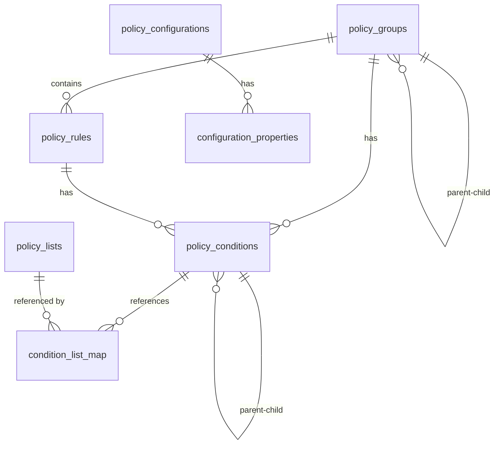

# 데이터베이스 스키마

다음 표는 정책 관련 데이터를 저장하기 위해 사용되는 주요 테이블입니다.

| 테이블 | 설명 |
| ------ | ---- |
| `policy_groups` | 정책 그룹 정보. 그룹 ID, 이름, 경로, 설명, 활성화 상태, 순서 등을 저장합니다. 계층 구조를 위한 `parent_group_id`를 포함하며, 원본 데이터는 `raw` JSON 필드에 저장됩니다. |
| `policy_rules` | 개별 룰 정보. 룰 ID, 이름, 소속 그룹 경로, 설명, 활성화 상태, 순서, 액션 정보를 포함합니다. 액션 관련 추가 옵션은 `action_options` JSON 필드에, 원본 데이터는 `raw` JSON 필드에 저장됩니다. |
| `policy_conditions` | 그룹과 룰의 조건을 저장합니다. `rule_id` 또는 `group_id`로 소속을 구분하며, 중첩 구조를 위해 `parent_id`를 사용합니다. 괄호, 연산자, 속성값 등이 저장되며, 복잡한 속성값은 `values` JSON 필드에, 원본 데이터는 `raw` JSON 필드에 저장됩니다. |
| `policy_lists` | 정책에서 참조하는 객체 리스트 항목을 저장합니다. 리스트 ID, 항목 ID, 값, 이름, 타입, 분류자, 설명을 포함하며, 추가 메타데이터는 `metadata` JSON 필드에, 원본 데이터는 `raw` JSON 필드에 저장됩니다. |
| `condition_list_map` | 조건과 리스트 간의 다대다 관계를 매핑합니다. `condition_id`와 `list_id`로 연결됩니다. |
| `policy_configurations` | Configuration 정보를 저장합니다. ID, 이름, 버전, MWG 버전, 템플릿 ID, 대상 ID, 설명을 포함하며, 추가 메타데이터는 `metadata` JSON 필드에, 원본 데이터는 `raw` JSON 필드에 저장됩니다. |
| `configuration_properties` | 각 configuration의 속성값을 저장합니다. 키, 값, 타입, 암호화 여부, 리스트 타입을 포함하며, 추가 메타데이터는 `metadata` JSON 필드에, 원본 데이터는 `raw` JSON 필드에 저장됩니다. |

## 테이블 관계

## 주요 특징

1. **원본 데이터 보존**
   - 모든 테이블이 `raw` JSON 필드를 통해 원본 데이터를 그대로 보존
   - 추가 메타데이터를 위한 `metadata` JSON 필드 제공

2. **계층 구조 지원**
   - 그룹의 계층 구조 (`parent_group_id`)
   - 조건의 중첩 구조 (`parent_id`)
   - 순서 관리를 위한 `order_number` 필드

3. **유연한 데이터 저장**
   - 복잡한 데이터는 JSON 필드로 저장 (`values`, `action_options`)
   - 기본적인 검색/필터링에 필요한 필드는 개별 컬럼으로 정규화

4. **상태 관리**
   - 활성화 상태 관리 (`enabled`)
   - 암호화 상태 관리 (`encrypted`)

각 테이블의 상세 컬럼 정의는 `ppat_db/policy_db.py`의 SQLAlchemy 모델에서 확인할 수 있습니다.
