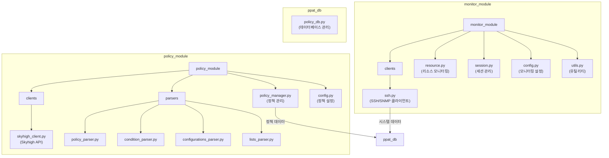

# 모듈 아키텍처

## 모듈 구조도

## 모듈 설명

### 1. monitor_module
- **역할**: 시스템 리소스 모니터링
- **구성 요소**:
  - `clients/`: 모니터링용 클라이언트
    - `ssh.py`: SSH/SNMP 통신 담당
  - `resource.py`: 리소스 모니터링 로직
  - `session.py`: 모니터링 세션 관리
  - `config.py`: 모니터링 설정
  - `utils.py`: 유틸리티 함수
- **데이터 흐름**: SSH/SNMP → 리소스 모니터링 → DB 저장

### 2. policy_module
- **역할**: 정책 관리 및 파싱
- **구성 요소**:
  - `clients/`: 정책 관련 클라이언트
    - `skyhigh_client.py`: Skyhigh SWG API 통신
  - `parsers/`: 정책 파싱 컴포넌트
    - `policy_parser.py`: 기본 정책 파싱
    - `condition_parser.py`: 조건 파싱
    - `configurations_parser.py`: 설정 파싱
    - `lists_parser.py`: 리스트 파싱
  - `policy_manager.py`: 정책 관리 총괄
  - `config.py`: 정책 관련 설정
- **데이터 흐름**: Skyhigh API → 정책 파싱 → DB 저장

### 3. ppat_db 모듈
- **역할**: 중앙 데이터 저장소
- **구성 요소**: 
  - `policy_db.py`: 데이터베이스 관리
- **데이터 처리**:
  - 모니터링 데이터 저장 (`monitor_module`에서 수신)
  - 정책 데이터 저장 (`policy_module`에서 수신)

## 주요 특징

1. **모듈 응집도**
   - 각 모듈이 명확한 책임을 가짐
   - 관련 기능들이 논리적으로 그룹화됨
   - 모듈별 독립적인 설정 관리

2. **클라이언트 분리**
   - `monitor_module/clients/`: 모니터링용 SSH/SNMP 클라이언트
   - `policy_module/clients/`: 정책 관리용 Skyhigh API 클라이언트
   - 각 클라이언트가 해당 모듈의 목적에 특화됨

3. **데이터 흐름 최적화**
   - 모니터링 데이터: SSH/SNMP → 리소스 모니터링 → DB
   - 정책 데이터: Skyhigh API → 정책 파싱 → DB
   - 명확한 데이터 처리 경로

4. **유지보수성**
   - 모듈별 독립적인 코드 관리
   - 설정의 중앙화
   - 관심사의 명확한 분리

5. **확장성**
   - 새로운 모니터링 클라이언트 추가 용이
   - 새로운 정책 파서 추가 용이
   - 모듈별 독립적인 기능 확장 가능 