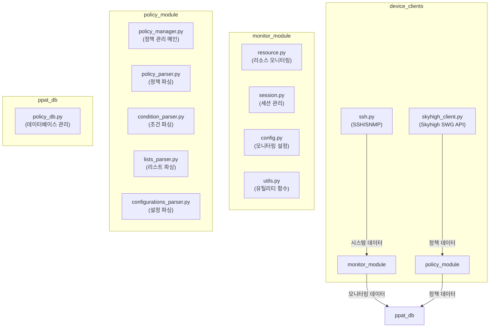

# 모듈 아키텍처

## 모듈 구조도

## 모듈 설명

### 1. device_clients 모듈

#### skyhigh_client.py
- **역할**: Skyhigh SWG API 통신
- **주요 기능**: 
  - 정책 데이터 수집
  - API 인증 및 세션 관리
- **연관 관계**: 
  - `policy_module`에만 데이터 제공
  - 모니터링과 무관

#### ssh.py
- **역할**: SSH/SNMP 통신
- **주요 기능**:
  - 시스템 접근 및 명령어 실행
  - SNMP 데이터 수집
- **연관 관계**:
  - `monitor_module`에만 데이터 제공
  - 정책 관리와 무관

### 2. monitor_module 모듈
- **역할**: 시스템 모니터링
- **데이터 소스**: SSH/SNMP만 사용 (API 사용 안 함)
- **구성 요소**:
  - `resource.py`: 리소스 모니터링 로직
  - `session.py`: 모니터링 세션 관리
  - `config.py`: 모니터링 설정
  - `utils.py`: 유틸리티 함수

### 3. policy_module 모듈
- **역할**: 정책 관리
- **데이터 소스**: Skyhigh SWG API만 사용 (SSH/SNMP 사용 안 함)
- **구성 요소**:
  - `policy_manager.py`: 정책 관리 총괄
  - `policy_parser.py`: 정책 파싱
  - `condition_parser.py`: 조건 파싱
  - `lists_parser.py`: 리스트 파싱
  - `configurations_parser.py`: 설정 파싱

### 4. ppat_db 모듈
- **역할**: 중앙 데이터 저장소
- **구성 요소**: 
  - `policy_db.py`: 데이터베이스 관리
- **데이터 처리**:
  - 모니터링 데이터 (`monitor_module`에서 수신)
  - 정책 데이터 (`policy_module`에서 수신)

## 주요 특징

1. **기능 분리**
   - 정책 관리와 시스템 모니터링이 완전히 분리
   - 각 기능이 독립적인 데이터 소스 사용

2. **모듈 독립성**
   - 각 모듈은 독립적으로 확장/수정 가능
   - 모듈 간 의존성 최소화

3. **데이터 흐름**
   - 정책 데이터: `skyhigh_client.py` → `policy_module` → `ppat_db`
   - 모니터링 데이터: `ssh.py` → `monitor_module` → `ppat_db`

4. **유지보수성**
   - 정책 관련 변경은 `policy_module`만 수정
   - 모니터링 관련 변경은 `monitor_module`만 수정
   - 데이터베이스 작업은 `ppat_db`로 중앙화 