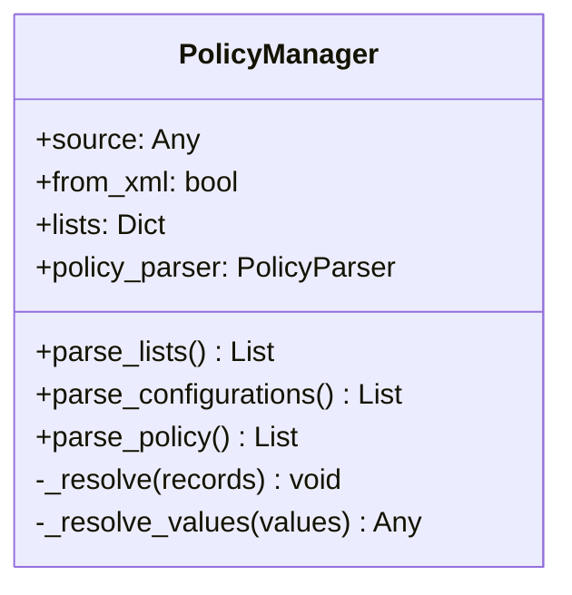
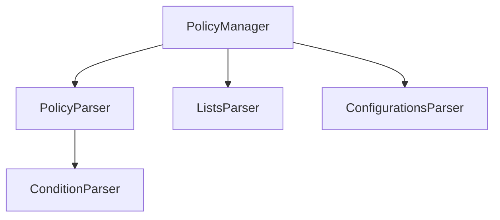

# Policy Manager 모듈 설명

## 개요

Policy Manager는 Skyhigh SWG의 정책 데이터를 파싱하고 관리하는 핵심 모듈입니다. 
이 모듈은 정책, 리스트, 설정 데이터를 파싱하고, 정책 내의 리스트 참조를 실제 리스트 항목으로 해석하는 역할을 합니다.

## 주요 기능

### 1. 데이터 파싱
- XML/JSON 형식의 정책 데이터 파싱
- 리스트, 설정, 정책 규칙 파싱
- 중첩된 정책 구조 처리

### 2. 리스트 참조 해석
- 정책 조건의 리스트 ID를 실제 리스트 항목으로 변환
- 단일/다중 리스트 참조 지원
- 리스트 데이터의 메모리 내 캐싱

## 사용 예시

```python
# 1. PolicyManager 초기화
source_data = """
<libraryContent>
    <lists>...</lists>
    <configurations>...</configurations>
    <ruleGroup>...</ruleGroup>
</libraryContent>
"""
manager = PolicyManager(source_data, from_xml=True)

# 2. 데이터 파싱
lists = manager.parse_lists()
configs = manager.parse_configurations()
records = manager.parse_policy()
```

## 데이터 구조

### 입력 데이터
```xml
<libraryContent>
    <!-- 리스트 데이터 -->
    <lists>
        <entry>
            <list_id>list_001</list_id>
            <content>...</content>
        </entry>
    </lists>
    
    <!-- 설정 데이터 -->
    <configurations>
        <configuration>...</configuration>
    </configurations>
    
    <!-- 정책 규칙 -->
    <ruleGroup>
        <rules>...</rules>
    </ruleGroup>
</libraryContent>
```

### 출력 데이터
```python
# 리스트 데이터
{
    'list_id': 'list_001',
    'content': [...],
}

# 정책 규칙 (리스트 참조 해석 후)
{
    'id': 'rule_001',
    'name': 'Sample Rule',
    'condition_raw': {...},
    'lists_resolved': [...],  # 실제 리스트 항목
}
```

## 클래스 구조

### PolicyManager



## 파서 의존성



## 에러 처리

1. **파싱 오류**
   - XML/JSON 파싱 실패
   - 필수 필드 누락
   - 잘못된 데이터 형식

2. **리스트 참조 오류**
   - 존재하지 않는 리스트 ID 참조
   - 잘못된 리스트 형식

## 성능 고려사항

1. **메모리 사용**
   - 리스트 데이터는 메모리에 캐시됨
   - 대용량 정책 처리 시 메모리 사용량 주의

2. **처리 속도**
   - 리스트 참조 해석은 O(1) 시간 복잡도
   - 전체 정책 파싱은 정책 크기에 비례

## 제한사항

1. 단일 소스 데이터만 지원
2. 메모리 내 처리로 인한 대용량 데이터 제한
3. XML과 JSON 형식만 지원

## 향후 개선사항

1. 스트리밍 파싱 지원
2. 비동기 처리 도입
3. 메모리 사용 최적화
4. 캐시 정책 개선

## 관련 문서

- [모듈 아키텍처](module_architecture.md)
- [Skyhigh SWG JSON 구조](skyhigh_swg_json_structure_prompt.md)
- [데이터베이스 스키마](db_schema.md) 