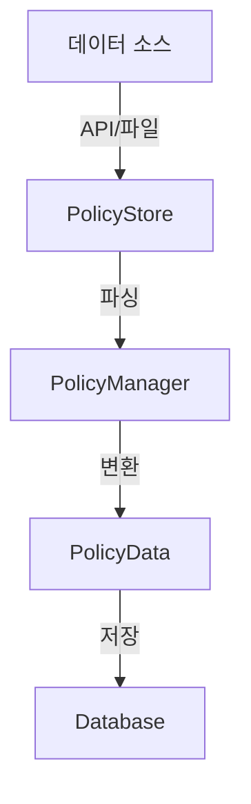

# Policy Store 모듈

## 개요

Policy Store는 Skyhigh SWG의 정책 데이터를 데이터베이스에 저장하는 단순하고 효율적인 모듈입니다.
API나 파일 소스로부터 데이터를 가져와서 파싱하고, 단일 트랜잭션으로 저장합니다.

## 주요 기능

### 1. API 데이터 저장
- Skyhigh SWG API에서 정책 데이터를 직접 가져옴
- Context Manager를 활용한 안전한 API 연결 관리
- 메인 룰셋 자동 선택

### 2. 소스 데이터 저장
- XML/JSON 형식의 소스 데이터 지원
- PolicyManager를 통한 데이터 파싱
- 단일 트랜잭션으로 일관성 보장

## 데이터 흐름



## 사용 예시

### 1. API에서 데이터 가져오기
```python
from policy_module.policy_store import PolicyStore
from sqlalchemy.orm import Session

# DB 세션 생성
session = Session()

# 저장소 초기화
store = PolicyStore(session)

# API에서 데이터 가져와서 저장
store.store_from_api(proxy_config)
```

### 2. 파일에서 데이터 가져오기
```python
# XML 파일에서 데이터 가져오기
with open('policy.xml', 'r') as f:
    content = f.read()
store.store_from_source(content, from_xml=True)

# JSON 파일에서 데이터 가져오기
with open('policy.json', 'r') as f:
    content = f.read()
store.store_from_source(content, from_xml=False)
```

## 데이터 구조

### PolicyData
정책 데이터를 담는 컨테이너 클래스입니다.

```python
@dataclass
class PolicyData:
    lists: List[Dict[str, Any]]          # 리스트 데이터
    configurations: List[Dict[str, Any]]  # 설정 데이터
    items: List[Dict[str, Any]]          # 그룹/규칙 통합 데이터
```

## 데이터베이스 테이블

| 테이블 | 설명 |
|--------|------|
| `policy_lists` | 정책 리스트 데이터 |
| `policy_configurations` | 정책 설정 데이터 |
| `policy_items` | 그룹/규칙 통합 데이터 |

## 에러 처리

1. **API 연결 오류**
   - API 연결 실패
   - 인증 오류
   - 데이터 가져오기 실패

2. **파싱 오류**
   - XML/JSON 파싱 실패
   - 필수 필드 누락
   - 데이터 형식 오류

3. **저장 오류**
   - 데이터베이스 연결 오류
   - 트랜잭션 실패
   - 제약 조건 위반

## 성능 고려사항

1. **메모리 사용**
   - 단일 데이터 컨테이너 사용
   - 불필요한 중간 객체 제거
   - 대용량 데이터 처리 고려

2. **처리 속도**
   - 단일 트랜잭션 사용
   - 벌크 삭제/삽입
   - 최소한의 데이터 변환

## 제한사항

1. 단일 메인 룰셋만 처리
2. 전체 데이터 교체 방식만 지원
3. 부분 업데이트 미지원

## 향후 개선사항

1. 부분 업데이트 기능 추가
2. 비동기 처리 지원
3. 데이터 검증 강화
4. 캐싱 메커니즘 도입

## 관련 문서

- [모듈 아키텍처](module_architecture.md)
- [데이터베이스 스키마](db_schema.md)
- [Policy Manager](policy_manager.md) 